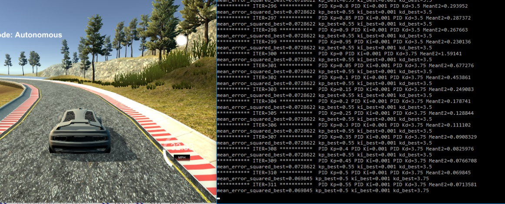

# **Self-Driving Car Engineer Nanodegree** #

# **Term2 – Project4: PID Controller** #

## **INTRODUCTION** ##

The purpose of the project is to build a PID controller for UDACITY’s
car simulator. The PID controller should be able to steer the car going
around the track loop without departing from the lane.

## **PID controllers** ##

PID stands for proportional, integral, and derivative controller. They
are used for loop feedback mechanism. Examples of PID are cruise control
on cars.

On this project the error(t) values is the Cross Track Error (CTE). The
constants for the PID controller are Kp, Ki, and Kd. U\[t) is the steer
input, that ranges from -1 to +1, but translates from -25deg to 25deg of
steer. The control function is:

These constants will be found by loop tuning.

## **PID implementation on C++ code** ##

File PID.cpp contains the PID class:

-   Initializes the PID

-   Updates the 3 errors:

    -   d\_error = cte - p\_error

    -   i\_error = i\_error + cte

    -   p\_error = cte

-   Calculates the total error ( u(t) ):

    -   p\_error \* Kp + d\_error \* Kd + i\_error \* Ki

## **PID for speed** ##

A PID controller was enabled to keep speed constant around 32MPH. This
was necessary to optimize the steer PID controller values, so that the
car would not be accel/braking at the same time as steering. The speed
PID was set to Kp=0.1 Ki=0 Kd=0 and the target speed to 35mph.

## **PID constants optimization** ##

The PID constants were found using a Global parameter search:

-   20 x 20 Kp and Kd grid (Ki was assumed to be small, since there is
    not systemic bias on the car)

-   Kp ranges from 0 to 1

-   Kd ranges from 0 to 4

Main.cpp will perform the global search by:

1-*ENABLE LINE* 48 if (iter == 0 && step ==0 ){pid.Init(0.00, 0.001,
0.00);}

2-*ENABLE LINES* 75-76:

> if (step ==0 && iter &gt; 0 ){pid.Init(pid.Kp + .05, pid.Ki, pid.Kd);}
>
> if (step ==0 && iter &gt; 0 && (iter % 20 == 0)){pid.Init(0.00,
> pid.Ki, pid.Kd + .25);}

Main.cpp will loop thru all the combinations of Kp and Kd and will reset
the simulator at the end of them. If the car leaves the track (very
large CTE) or is doing circles stuck on the terrain (very small speed),
the iteration is not valid, and the search moves on to the next set of
Kp/Kd:

After running the global search for 400 combinations, the following
function is obtained:

The 3D plot shows the mean squared CTE as a function of Kp and Kd. From
the plot we can tell that the function keeps getting smaller as Kd gets
larger, for a range of Kp \~ 0.15 – 0.75.

The solution I picked was Kp=0.15 and Kd=1.75. It is implemented on :

*LINE49* pid.Init(0.15, 0.001, 1.75); // USE this line if not GLOBAL
optimization

## **Conclusions** ##

-   A global search for Kp and Kd was able to return good params for
    going around the loop without leaving the track. It may be
    computationally inneficient, but it returns a map that can be used
    to make sense of the results.

-   There may be different optimum values for other speeds (much higher
    and lower), that will have to be tuned too.

-   Frequency of oscillation may to be to high (too responsive) for high
    values of Kp. This may be uncomfortable for passengers.

